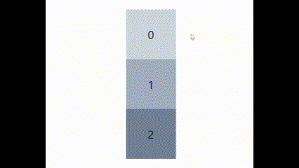

# Use Reorder

> Simple hooks-based list reorder running on `react-beautiful-dnd`


Your usual reorderer       |  Arbitrary number of lists
:-------------------------:|:-------------------------:
  |  

Optional hint animations      | For both single and multiple lists
:-------------------------:|:-------------------------:
 |  

## Usage

### Single list

```jsx
import { useReorder, Item } from 'use-reorder'

function MyComponent() {
    const items: Item[] = [
        { id: 'id1', elem: <div>...</div> },
        // ...
        { id: 'idn', elem: <div>...</div> },
    ]

    const { order, ordered, reorderer } = useReorder(items)
    // ordered = order.map(i => items[i]); provided for convenience

    return (
        <div>
            ...
            {reorderer}
        </div>
    )
}

```

### Multiple lists

As opposed to the single list, now you're in control of `<DragDropContext>`. **Make sure it wraps all `lists` and that you pass it the returned `onDragEnd`**. As long as that holds, you can place the lists wherever you please.

```jsx
import { DragDropContext } from 'react-beautiful-dnd'
import { useMultiReorder } from 'use-reorder'

const items = [
  { id: 'item1', item: (...) => <div>...</div> },
  { id: 'item2', item: (...) => <div>...</div> },
  ...
]
const listIds = [{id: 'list1'}, {id: 'list2'}, ...]
const { onDragEnd, lists, order } = useMultiReorder(items, listIds)

return (
  <DragDropContext onDragEnd={onDragEnd}>
     ...
     {lists.map(list => (
       <div>{list}</div>
     ))}
  </DragDropContext>
)
```

## Hint animation

Optionally, you can install [`framer-animations`](https://www.npmjs.com/package/framer-animations) to add this animations (useful as a simple guide for users)

Single list      | Multiple lists
:-------------------------:|:-------------------------:
 |  

```bash
npm i framer-animations
```

```bash
yarn add framer-animations
```

### Single: `useAnimatedReorder`

Exactly the same as `useReorder` but returns a `run` function to trigger the animation
```jsx
import { useAnimatedReorder } from 'use-reorder/dist/animated'

const { reorderer, run } = useAnimatedReorder(items)
```

### Multi (`useMultiAnimation` + `useMultiReorder`)

```jsx
import { useMultiReorder, MultiItem } from 'use-reorder'
import { useMultiAnimation } from 'use-reorder/dist/animated'

const { animation, run, sensor } = useMultiAnimation('animated-item')

const items = [
 { id: 'some-item', elem: () => <div>...</div> },
 { id: 'animated-item', elem: () => <div style={{position: 'relative'}}>...{animation}</div> } // inject the animation to the animated item
]

const { onDragEnd, .., } = useMultiReorder(items, ...)

return (
 <DragDropContext onDragEnd={onDragEnd} sensors={[sensor]}>
 ...
```